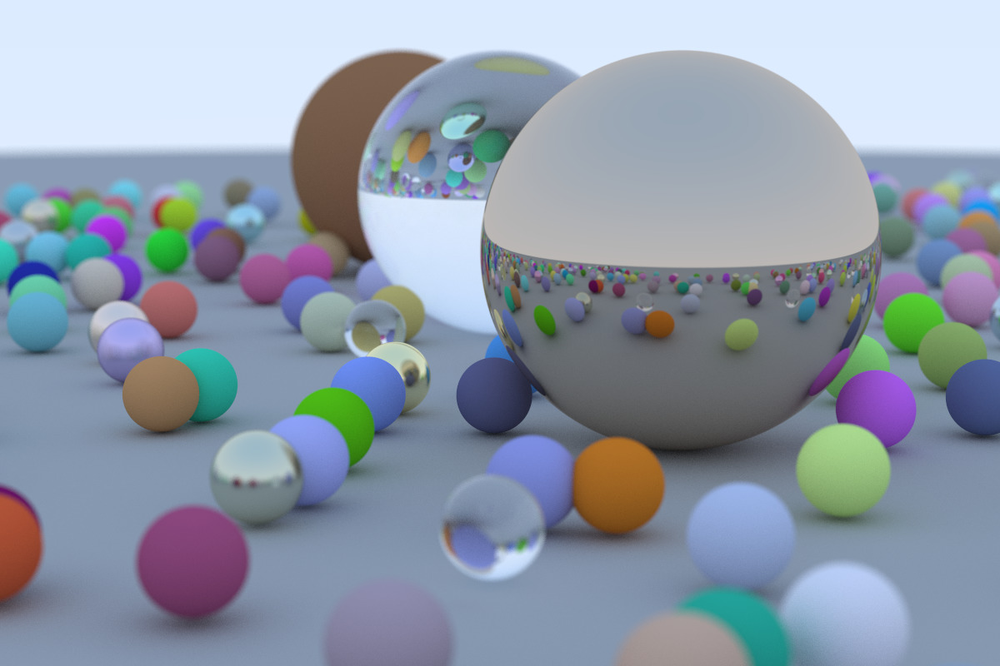

# Ray Tracing in One Weekend - Rust
This repo is a Rust realization of [Ray Tracing in One Weekend](https://raytracing.github.io/).

## Extra Features (Not Implemented in the vanilla version)
- multithreading rendering (CPU)
- generic type (not perfect)


## How to run
you can turn on your compiler's optimize option to make it fast
```shell
cargo run > image.ppm
# optimized (faster)
cargo run -r > image.ppm
```

**Happy for feedbacks and comments since it is my first Rust project.** 🤗

## Render Results

